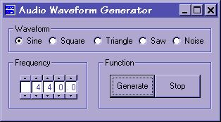

## Audio Waveform Generator

### Description

A simple, general purpose audio waveform generator. Features Sine, Square, Triangle and Sawtooth waveforms plus White Noise. DirectX8 is used for playback but the code could be easily modified for earlier DirectX versions. Vertical scrollers and TextBoxes are used to create an up/down pushbutton frequency selector. The code is fully commented and hopefully easy to understand. Your feedback and/or votes are appreciated ;-)
 
### More Info
 

             |
---                |---
**Submitted On**   |2002-03-10 16:01:32
**By**             |[Michael Hebert](https://github.com/Planet-Source-Code/PSCIndex/blob/master/ByAuthor/michael-hebert.md)
**Level**          |Beginner
**User Rating**    |4.8 (57 globes from 12 users)
**Compatibility**  |VB 6\.0
**Category**       |[Sound/MP3](https://github.com/Planet-Source-Code/PSCIndex/blob/master/ByCategory/sound-mp3__1-45.md)
**World**          |[Visual Basic](https://github.com/Planet-Source-Code/PSCIndex/blob/master/ByWorld/visual-basic.md)
**Archive File**   |[Audio\_Wave610723102002\.zip](https://github.com/Planet-Source-Code/michael-hebert-audio-waveform-generator__1-32566/archive/master.zip)

